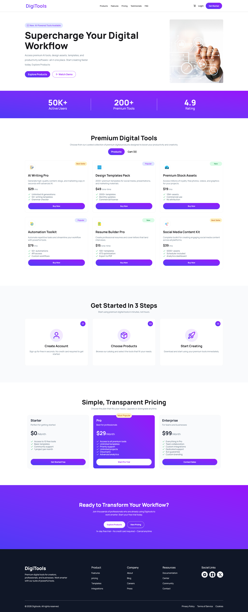

# 📘 DigiTools

DigiTools is a modern React-based web application that showcases various digital tools in an organized way.  
Users can explore tools, view details, and interact with a responsive and clean UI designed for better user experience.

---

## 📸 Preview



---

## 🚀 Live Demo

🔗 Live Website: https://diigitools.netlify.app/  
🔗 GitHub Repository: https://github.com/nafiz2024/Programming-Hero-Assignment-06

---

## ✨ Features

- 🧰 Digital tools listing interface
- 🔎 Tool details view
- 🔔 Toast notification using React-Toastify
- ⚡ Fast and dynamic UI with React
- 📱 Fully responsive design
- 🎨 Clean UI using Tailwind CSS & DaisyUI
- 📂 Data loaded from JSON file
- ⏳ Smooth user experience

---

## 🧠 How It Works

1. React application loads tool data from JSON file.
2. Tools are displayed in card format.
3. Users can interact with tools and view details.
4. Toast notifications appear for user actions.
5. UI updates dynamically based on state.

---

## 🛠️ Technologies Used

### Frontend
- React.js
- JavaScript (ES6+)
- Tailwind CSS
- DaisyUI

### Libraries
- React-Toastify

### Data
- JSON

---

## 📦 Dependencies

```bash
npm install react-toastify
```

---

## ⚙️ Installation

Clone the repository:

```bash
git clone https://github.com/nafiz2024/Programming-Hero-Assignment-06.git
```

Go to project folder:

```bash
cd Programming-Hero-Assignment-06
```

Install dependencies:

```bash
npm install
```

Run the project:

```bash
npm run dev
```

Build for production:

```bash
npm run build
```

---

## 📂 Project Structure

```bash
src
│
├── components
│   ├── Navbar
│   ├── ToolsCard
│   ├── ToolDetails
│   └── Toast
│
├── data
│   └── tools.json
│
├── assets
│   └── images
│
├── App.jsx
├── main.jsx
└── index.css
```

---

## 📸 Screenshots

### Tool Details


### Cart Details


---

## 🔮 Future Improvements

- Search functionality
- Category filter
- Favorite tools system
- Backend integration
- User authentication
- Dark mode

---

## 👨‍💻 Author

**Nafiz Alam**  
Frontend Web Developer | MERN Stack Developer  

- 🌐 GitHub: https://github.com/nafiz2024  
- 💼 LinkedIn: https://www.linkedin.com/in/nafiz-alam04/  
- 📧 Email: nafizalam.dev@email.com  

---

## ⭐ Support

If you like this project, give it a star on GitHub ⭐